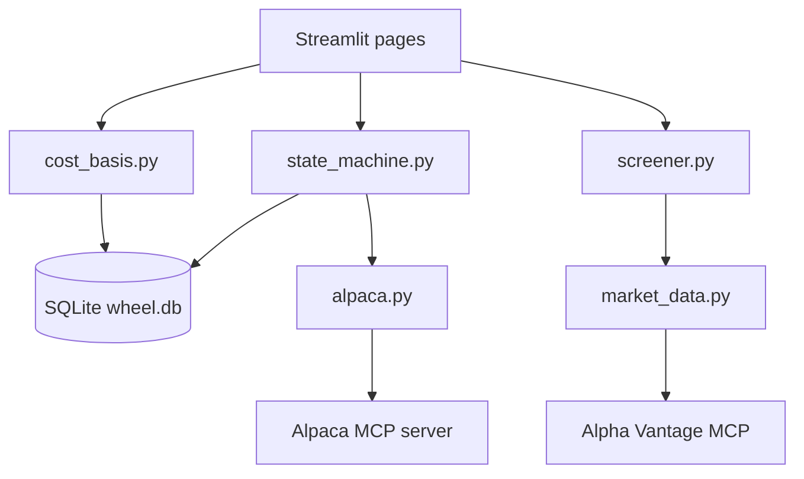

<!-- PROJECT_CONTEXT.md — generated file for Claude Project upload. Do not edit directly. -->
<!-- Source files: CLAUDE.md, docs/*.md, db/schema.sql -->
<!-- Regenerate with: scripts/build_context.sh -->
# WHEEL TRADER — PROJECT CONTEXT

> This file is the complete context for the Wheel Trader project. Read it in full before responding to any request.

---

<!-- SOURCE: CLAUDE.md -->

# Wheel Trader

A Python/Streamlit app for screening equities for the Wheel options strategy, tracking positions, and executing trades via Alpaca paper trading (with manual real-trade entry in parallel).

## Stack

- **UI**: Streamlit
- **DB**: SQLite (single file, `db/wheel.db`)
- **State/logic**: Pure Python modules in `src/`
- **Broker integration**: Alpaca MCP server (paper trades only)
- **Market data**: Alpha Vantage MCP server
- **Schema source of truth**: `db/schema.sql`

## Before writing any code, read:

| Task | Read first |
|---|---|
| Any DB change | `docs/data-model.md` |
| Any trade/position logic | `docs/state-machine.md` + `docs/cost-basis-rules.md` |
| New feature / module | `docs/architecture.md` + `docs/conventions.md` |
| Cost basis calculation | `docs/cost-basis-rules.md` — do not improvise this |

## Hard constraints

1. **Never write directly to `cycle.cost_basis`** — it is a SQLite VIRTUAL GENERATED column derived from `assignment_price` and `total_premium`. Update `total_premium` instead.
2. **All state transitions go through `src/state_machine.py`** — no raw SQL UPDATE on `cycle.state` anywhere else.
3. **Rolls are stored as two `trade` rows** (`ROLL_CLOSE` + `ROLL_OPEN`) linked by `roll_group_id` — never as one row.
4. **Source enum is strict**: `ALPACA_PAPER` or `MANUAL` only. No live Alpaca execution until explicitly enabled.
5. **No business logic in Streamlit pages** — pages call `src/` functions, they do not compute state or P&L directly.
6. **Schema changes require updating both `db/schema.sql` and `docs/data-model.md`** in the same commit.

## Repo layout

```
db/             schema.sql + SQLite file (not committed)
docs/           architecture, data model, state machine, cost basis, conventions
src/
  db.py         DB connection + helpers
  state_machine.py  sole authority on cycle state transitions
  cost_basis.py     cost basis calculation and validation
  alpaca.py     Alpaca MCP calls (paper only)
  market_data.py    Alpha Vantage calls
  screener.py   equity screening logic
pages/          Streamlit pages (UI only, no business logic)
tests/          pytest unit tests for src/ modules
```

---

<!-- SOURCE: docs/architecture.md -->

# Architecture

## Component map



## Data flow: entering a trade

1. User selects ticker in Streamlit screener
2. `screener.py` fetches IV rank from `market_data.py`
3. User confirms CSP parameters (strike, expiration, contracts)
4. UI calls `state_machine.open_short_put()`
5. `state_machine.py` validates inputs, creates `cycle` + `trade` rows, optionally calls `alpaca.py` to submit paper order
6. Paper fill confirmed via Alpaca MCP → `trade.broker_order_id` populated

## Data flow: roll

1. User triggers roll from position dashboard
2. UI calls `state_machine.roll_position(cycle_id, close_params, open_params)`
3. State machine writes two `trade` rows (`ROLL_CLOSE`, `ROLL_OPEN`) with shared `roll_group_id`
4. State machine writes one `roll_event` row for UI display
5. `cycle.total_premium` updated with net credit
6. `cycle.state` unchanged (still `SHORT_PUT` or `SHORT_CALL`)

## Data flow: assignment

1. Alpaca MCP notifies assignment OR user enters manually
2. UI calls `state_machine.record_assignment(cycle_id, fill_price)`
3. State machine writes `BUY_STOCK / ASSIGNMENT` trade row
4. `cycle.assignment_price` set to fill price
5. `cycle.state` → `LONG_STOCK`
6. `cycle.cost_basis` auto-recomputes (VIRTUAL column)

## Key design decisions

- **SQLite over Postgres**: single-user, local, no infra to manage. Migrate later if needed.
- **VIRTUAL GENERATED cost_basis**: eliminates entire class of update bugs. Cannot be wrong.
- **State machine as single module**: any code that bypasses it is a bug by definition.
- **Paper-only Alpaca integration**: `ALPACA_LIVE` source enum value reserved but not wired. Requires explicit flag to enable.
- **Manual entry path**: every Alpaca action has a manual equivalent so real trades are always recordable.

---

<!-- SOURCE: docs/data-model.md -->

# Data model

Source of truth for schema is `db/schema.sql`. This doc explains the *why* behind each decision.

## Tables

### `underlying`

Tickers being watched or actively wheeled. One row per ticker, ever.

```sql
CREATE TABLE underlying (
    underlying_id   TEXT PRIMARY KEY,       -- same as ticker, e.g. "RKLB"
    ticker          TEXT UNIQUE NOT NULL,
    notes           TEXT,                   -- why this ticker is Wheel-eligible
    iv_rank_cached  REAL,                   -- last fetched IVR (0-100)
    iv_rank_updated DATETIME,
    created_at      DATETIME DEFAULT CURRENT_TIMESTAMP
);
```

`underlying_id = ticker` is intentional — avoids a join in every query and there is no ambiguity.

---

### `cycle`

One Wheel attempt on one ticker. Unit of P&L measurement. A cycle begins at first CSP sale and ends at close/expiration/called-away.

```sql
CREATE TABLE cycle (
    cycle_id         INTEGER PRIMARY KEY AUTOINCREMENT,
    underlying_id    TEXT NOT NULL REFERENCES underlying(underlying_id),
    state            TEXT NOT NULL DEFAULT 'SHORT_PUT'
                     CHECK(state IN ('SHORT_PUT','LONG_STOCK','SHORT_CALL','CLOSED')),
    lot_id           TEXT,               -- user label for concurrent cycles, e.g. 'RKLB-2025-01'
    shares_held      INTEGER DEFAULT 0,
    assignment_price REAL,               -- per-share price at stock assignment
    assignment_strike REAL,              -- the put strike (reference only)
    total_premium    REAL NOT NULL DEFAULT 0,  -- running sum of all net credits this cycle
    cost_basis       REAL GENERATED ALWAYS AS
                     (assignment_price - (total_premium / 100.0)) VIRTUAL,
    opened_at        DATETIME DEFAULT CURRENT_TIMESTAMP,
    closed_at        DATETIME,
    realized_pnl     REAL,               -- populated when state → CLOSED
    notes            TEXT,
    UNIQUE(underlying_id, lot_id)
);
```

**`cost_basis` is VIRTUAL** — it is always derived, never set. If `assignment_price` or `total_premium` change, it updates automatically. Do not attempt to UPDATE this column; SQLite will reject it.

**`total_premium` is per-cycle cumulative net credit in dollars** (not per-share). Formula: `cost_basis = assignment_price - (total_premium / 100)`. See `docs/cost-basis-rules.md` for a worked example.

**`lot_id`** supports concurrent cycles on the same ticker. If running one cycle at a time, leave null or auto-assign.

**`IDLE` is not a state** — it is the absence of a cycle row. The screener shows tickers from `underlying` with no active cycle as candidates.

---

### `trade`

Every individual leg. The immutable audit trail. Never delete rows; mark them with notes if erroneous.

```sql
CREATE TABLE trade (
    trade_id        INTEGER PRIMARY KEY AUTOINCREMENT,
    cycle_id        INTEGER NOT NULL REFERENCES cycle(cycle_id),
    underlying_id   TEXT NOT NULL REFERENCES underlying(underlying_id),
    trade_type      TEXT NOT NULL CHECK(trade_type IN (
                        'SELL_PUT','BUY_PUT',
                        'SELL_CALL','BUY_CALL',
                        'BUY_STOCK','SELL_STOCK'
                    )),
    leg_role        TEXT NOT NULL CHECK(leg_role IN (
                        'OPEN','CLOSE','ROLL_CLOSE','ROLL_OPEN',
                        'ASSIGNMENT','EXPIRATION','CALLED_AWAY'
                    )),
    roll_group_id   TEXT,               -- links ROLL_CLOSE + ROLL_OPEN as one logical roll
    expiration      DATE,               -- options only
    strike          REAL,               -- options only
    contracts       INTEGER NOT NULL DEFAULT 1,
    price_per_share REAL NOT NULL,      -- premium per share; negative = debit paid
    net_credit      REAL NOT NULL,      -- contracts × 100 × price_per_share
    commission      REAL NOT NULL DEFAULT 0,
    filled_at       DATETIME NOT NULL,
    source          TEXT NOT NULL CHECK(source IN ('ALPACA_PAPER','MANUAL')),
    broker_order_id TEXT,               -- Alpaca order ID if applicable
    notes           TEXT
);
```

**`net_credit` sign convention**: positive = credit received, negative = debit paid. A `SELL_PUT` has positive `net_credit`. A `BUY_PUT` (to close) has negative.

**Rolls are always two rows**: `ROLL_CLOSE` (negative net_credit, buying back) + `ROLL_OPEN` (positive net_credit, selling new). Link them with the same `roll_group_id` UUID. The sum of both is the net credit of the roll.

**`EXPIRATION` leg_role**: when an option expires worthless, record a synthetic close with `price_per_share = 0`, `net_credit = 0`. This keeps the trade log complete.

---

### `roll_event`

One row per roll, for display purposes. Derived from the two `trade` rows but stored for query convenience.

```sql
CREATE TABLE roll_event (
    roll_group_id   TEXT PRIMARY KEY,
    cycle_id        INTEGER NOT NULL REFERENCES cycle(cycle_id),
    old_expiration  DATE,
    new_expiration  DATE,
    old_strike      REAL,
    new_strike      REAL,
    net_credit      REAL,               -- net of ROLL_CLOSE + ROLL_OPEN
    rolled_at       DATETIME,
    notes           TEXT
);
```

---

### `cycle_summary` (view)

```sql
CREATE VIEW cycle_summary AS
SELECT
    c.cycle_id,
    c.underlying_id,
    c.lot_id,
    c.state,
    c.assignment_price,
    c.total_premium,
    c.cost_basis,
    c.shares_held,
    c.opened_at,
    c.closed_at,
    c.realized_pnl,
    COUNT(t.trade_id)                                        AS trade_count,
    SUM(CASE WHEN t.leg_role IN ('ROLL_CLOSE','ROLL_OPEN')
        THEN 1 ELSE 0 END) / 2                              AS roll_count,
    SUM(t.net_credit) - SUM(COALESCE(t.commission, 0))      AS net_pnl_to_date
FROM cycle c
LEFT JOIN trade t ON t.cycle_id = c.cycle_id
GROUP BY c.cycle_id;
```

## Indexes

```sql
CREATE INDEX idx_trade_cycle    ON trade(cycle_id);
CREATE INDEX idx_trade_filled   ON trade(filled_at);
CREATE INDEX idx_cycle_ticker   ON cycle(underlying_id, state);
```

---

<!-- SOURCE: docs/state-machine.md -->

# State machine

All cycle state transitions are enforced in `src/state_machine.py`. No other module may UPDATE `cycle.state` directly.

## States

| State | Meaning |
|---|---|
| `SHORT_PUT` | CSP is open, monitoring |
| `LONG_STOCK` | Assigned; holding shares, no CC open |
| `SHORT_CALL` | CC is open against held shares |
| `CLOSED` | Cycle complete, no open positions |

`IDLE` is not a state — it is the absence of a cycle row.

## Valid transitions

| From | Event | To | Trades written |
|---|---|---|---|
| *(none)* | `open_short_put()` | `SHORT_PUT` | `SELL_PUT / OPEN` |
| `SHORT_PUT` | `roll_position()` | `SHORT_PUT` | `BUY_PUT / ROLL_CLOSE` + `SELL_PUT / ROLL_OPEN` |
| `SHORT_PUT` | `close_position()` | `CLOSED` | `BUY_PUT / CLOSE` |
| `SHORT_PUT` | `record_expiration()` | `CLOSED` | `BUY_PUT / EXPIRATION` (price=0) |
| `SHORT_PUT` | `record_assignment()` | `LONG_STOCK` | `BUY_STOCK / ASSIGNMENT` |
| `LONG_STOCK` | `open_short_call()` | `SHORT_CALL` | `SELL_CALL / OPEN` |
| `SHORT_CALL` | `roll_position()` | `SHORT_CALL` | `BUY_CALL / ROLL_CLOSE` + `SELL_CALL / ROLL_OPEN` |
| `SHORT_CALL` | `close_position()` | `LONG_STOCK` | `BUY_CALL / CLOSE` |
| `SHORT_CALL` | `record_expiration()` | `LONG_STOCK` | `BUY_CALL / EXPIRATION` (price=0) |
| `SHORT_CALL` | `record_called_away()` | `CLOSED` | `SELL_STOCK / CALLED_AWAY` |

Any transition not in this table is invalid. The state machine must raise `InvalidTransitionError`.

## Transition side effects

**`record_assignment(cycle_id, fill_price)`**
- Sets `cycle.assignment_price = fill_price`
- Sets `cycle.shares_held = contracts × 100`
- `cycle.cost_basis` recomputes automatically (VIRTUAL column)

**Any credit trade (SELL_PUT, SELL_CALL, ROLL_OPEN)**
- Adds `net_credit` to `cycle.total_premium`
- `cycle.cost_basis` recomputes automatically

**Any debit trade (BUY_PUT, BUY_CALL, ROLL_CLOSE)**
- Subtracts `abs(net_credit)` from `cycle.total_premium`
- This correctly reduces the total credit when closing at a debit

**`record_called_away(cycle_id, fill_price)`**
- Writes `SELL_STOCK / CALLED_AWAY` trade
- Computes `realized_pnl`: `(fill_price - cost_basis) × shares_held`
- Sets `cycle.state = CLOSED`, `cycle.closed_at = now()`
- Sets `cycle.shares_held = 0`

**`record_expiration()` (option expires worthless)**
- Writes synthetic close trade with `price_per_share = 0`, `net_credit = 0`
- Does NOT add to `total_premium` (zero credit)
- Transitions state per table above

## Roll mechanics

A roll is always two separate `trade` rows:

```python
roll_group_id = str(uuid.uuid4())

# Leg 1: close existing position (debit)
write_trade(trade_type='BUY_PUT', leg_role='ROLL_CLOSE',
            roll_group_id=roll_group_id, price_per_share=-close_price, ...)

# Leg 2: open new position (credit)
write_trade(trade_type='SELL_PUT', leg_role='ROLL_OPEN',
            roll_group_id=roll_group_id, price_per_share=open_price, ...)

# Write roll_event for UI display
write_roll_event(roll_group_id=roll_group_id, net_credit=open_credit - close_debit, ...)

# Update total_premium with net
update_total_premium(cycle_id, net_credit=(open_credit - close_debit))
```

`cycle.state` does not change on a roll.

## Error handling

- `InvalidTransitionError`: attempted transition not in the valid table
- `CycleNotFoundError`: cycle_id does not exist
- `CycleClosedError`: any mutation attempted on a CLOSED cycle

---

<!-- SOURCE: docs/cost-basis-rules.md -->

# Cost basis rules

## Formula

```
cost_basis (per share) = assignment_price - (total_premium / 100)
```

`total_premium` is the running cumulative net credit for the entire cycle, in dollars (not per-share). Dividing by 100 converts to per-share (1 contract = 100 shares).

This is a VIRTUAL GENERATED column in SQLite. It is never set directly.

## What counts toward total_premium

| Event | Effect on total_premium |
|---|---|
| Sell CSP (open) | + net_credit |
| Buy CSP to close early | - abs(net_credit) |
| CSP expires worthless | + 0 (no change) |
| Roll CSP: buy to close | - abs(net_credit) of closing leg |
| Roll CSP: sell to open | + net_credit of opening leg |
| Stock assigned | no change (assignment_price is set separately) |
| Sell CC | + net_credit |
| Buy CC to close | - abs(net_credit) |
| CC expires worthless | + 0 |
| Roll CC: buy to close | - abs(net_credit) of closing leg |
| Roll CC: sell to open | + net_credit of opening leg |
| Stock called away | no change (triggers realized_pnl calc) |

## Worked example

**Setup**: 1 contract on XYZ, $50 strike CSP.

### Step 1 — Sell CSP

- Sold 1x $50 put for $1.50/share → `net_credit = $150`
- `total_premium = $150`
- `assignment_price = null` (not yet assigned)
- `cost_basis = null`

### Step 2 — Roll CSP (defensive, put is ITM)

- Bought back put for $2.00/share → debit $200
- Sold new put at $48 strike for $1.80/share → credit $180
- Net roll: -$20
- `total_premium = $150 - $200 + $180 = $130`

### Step 3 — Assigned at $48 strike

- Fill price: $48.00/share
- `assignment_price = $48.00`
- `shares_held = 100`
- `total_premium = $130` (unchanged)
- `cost_basis = $48.00 - ($130 / 100) = $48.00 - $1.30 = $46.70`

### Step 4 — Sell CC at $49 strike

- Sold 1x $49 call for $0.90/share → `net_credit = $90`
- `total_premium = $130 + $90 = $220`
- `cost_basis = $48.00 - ($220 / 100) = $48.00 - $2.20 = $45.80`

### Step 5 — CC expires worthless

- Synthetic close at $0 — no change to `total_premium`
- `cost_basis = $45.80` (unchanged)

### Step 6 — Sell another CC at $49 strike

- Sold 1x $49 call for $0.70/share → `net_credit = $70`
- `total_premium = $220 + $70 = $290`
- `cost_basis = $48.00 - ($290 / 100) = $48.00 - $2.90 = $45.10`

### Step 7 — Called away at $49 strike

- Fill: $49.00/share
- `realized_pnl = ($49.00 - $45.10) × 100 = $390`
- Cycle → `CLOSED`

## Common mistakes to avoid

**Do not** recalculate cost_basis from scratch at call time — the VIRTUAL column handles it.

**Do not** add the full assignment strike to total_premium — assignment price and premium are tracked separately and combined in the formula.

**Do not** exclude roll debits from total_premium — a roll that costs net $20 reduces the total credit and therefore increases cost basis. This is correct behavior.

**Do not** reset total_premium when transitioning from SHORT_PUT to LONG_STOCK — premium from the put phase reduces cost basis in the stock phase.

---

<!-- SOURCE: docs/conventions.md -->

# Conventions

## Module responsibilities

| Module | Owns | Does not own |
|---|---|---|
| `src/state_machine.py` | All cycle state transitions, trade writes | UI, market data |
| `src/cost_basis.py` | Cost basis validation, P&L helpers | State transitions |
| `src/db.py` | DB connection, raw query helpers | Business logic |
| `src/alpaca.py` | Alpaca MCP calls, order formatting | State decisions |
| `src/market_data.py` | Alpha Vantage calls, IV rank fetch | Trade logic |
| `src/screener.py` | Equity screening criteria, candidate ranking | Execution |
| `pages/` | Streamlit UI only | Any computation |

## Naming

- Functions that write to DB: `create_`, `record_`, `update_` prefix
- Functions that only read: `get_`, `fetch_`, `list_` prefix
- State machine public API: verb-noun, e.g. `open_short_put`, `record_assignment`, `roll_position`
- Enums match DB CHECK constraints exactly: use the string literals, not magic values

## Adding a new trade type

1. Add the value to the `trade_type` CHECK in `db/schema.sql`
2. Add the corresponding transition to the table in `docs/state-machine.md`
3. Implement the transition function in `src/state_machine.py`
4. Update `db/schema.sql` and `docs/data-model.md` in the same commit

## Alpaca MCP calls

- All Alpaca calls go through `src/alpaca.py` — no MCP calls in pages or state machine
- Always check `cycle.source` before submitting — only `ALPACA_PAPER` cycles submit to Alpaca
- Every Alpaca action has a manual fallback path (user enters fill manually if paper order fails)

## Testing expectations

- `src/state_machine.py` must have unit tests for every valid transition and every invalid transition (should raise `InvalidTransitionError`)
- `src/cost_basis.py` must have a test that walks the full worked example from `docs/cost-basis-rules.md` step by step
- No Streamlit-dependent code in `src/` — pages are not unit tested

## DB migrations

- Schema changes: update `db/schema.sql`, write a migration script in `db/migrations/`
- Never ALTER a VIRTUAL GENERATED column — drop and recreate the table
- Migration scripts are numbered sequentially: `001_initial.sql`, `002_add_lot_id.sql`, etc.

---

<!-- SOURCE: db/schema.sql -->

## Schema (canonical DDL)

```sql
-- Wheel Trader schema
-- Source of truth. Changes here must be reflected in docs/data-model.md.

CREATE TABLE IF NOT EXISTS underlying (
    underlying_id   TEXT PRIMARY KEY,
    ticker          TEXT UNIQUE NOT NULL,
    notes           TEXT,
    iv_rank_cached  REAL,       -- (current - 52w_low) / (52w_high - 52w_low) * 100
    iv_pct_cached   REAL,       -- % of days in past year IV was below current
    iv_current      REAL,       -- raw current IV (30-day)
    iv_52w_high     REAL,
    iv_52w_low      REAL,
    iv_updated      DATETIME,
    created_at      DATETIME DEFAULT CURRENT_TIMESTAMP
);

CREATE TABLE IF NOT EXISTS cycle (
    cycle_id         INTEGER PRIMARY KEY AUTOINCREMENT,
    underlying_id    TEXT NOT NULL REFERENCES underlying(underlying_id),
    state            TEXT NOT NULL DEFAULT 'SHORT_PUT'
                     CHECK(state IN ('SHORT_PUT','LONG_STOCK','SHORT_CALL','CLOSED')),
    lot_id           TEXT,
    shares_held      INTEGER DEFAULT 0,
    assignment_price REAL,
    assignment_strike REAL,
    total_premium    REAL NOT NULL DEFAULT 0,
    cost_basis       REAL GENERATED ALWAYS AS
                     (assignment_price - (total_premium / 100.0)) VIRTUAL,
    opened_at        DATETIME DEFAULT CURRENT_TIMESTAMP,
    closed_at        DATETIME,
    realized_pnl     REAL,
    notes            TEXT,
    UNIQUE(underlying_id, lot_id)
);

CREATE TABLE IF NOT EXISTS trade (
    trade_id        INTEGER PRIMARY KEY AUTOINCREMENT,
    cycle_id        INTEGER NOT NULL REFERENCES cycle(cycle_id),
    underlying_id   TEXT NOT NULL REFERENCES underlying(underlying_id),
    trade_type      TEXT NOT NULL CHECK(trade_type IN (
                        'SELL_PUT','BUY_PUT',
                        'SELL_CALL','BUY_CALL',
                        'BUY_STOCK','SELL_STOCK'
                    )),
    leg_role        TEXT NOT NULL CHECK(leg_role IN (
                        'OPEN','CLOSE','ROLL_CLOSE','ROLL_OPEN',
                        'ASSIGNMENT','EXPIRATION','CALLED_AWAY'
                    )),
    roll_group_id   TEXT,
    expiration      DATE,
    strike          REAL,
    contracts       INTEGER NOT NULL DEFAULT 1,
    price_per_share REAL NOT NULL,
    net_credit      REAL NOT NULL,
    commission      REAL NOT NULL DEFAULT 0,
    filled_at       DATETIME NOT NULL,
    source          TEXT NOT NULL CHECK(source IN (
                        'TRADIER_SANDBOX','TRADIER_LIVE','MANUAL'
                    )),
    broker_order_id TEXT,
    fill_status     TEXT NOT NULL DEFAULT 'CONFIRMED'
                    CHECK(fill_status IN ('PENDING','CONFIRMED','REJECTED')),
    notes           TEXT
);

CREATE TABLE IF NOT EXISTS roll_event (
    roll_group_id   TEXT PRIMARY KEY,
    cycle_id        INTEGER NOT NULL REFERENCES cycle(cycle_id),
    old_expiration  DATE,
    new_expiration  DATE,
    old_strike      REAL,
    new_strike      REAL,
    net_credit      REAL,
    rolled_at       DATETIME,
    notes           TEXT
);

CREATE INDEX IF NOT EXISTS idx_trade_cycle    ON trade(cycle_id);
CREATE INDEX IF NOT EXISTS idx_trade_filled   ON trade(filled_at);
CREATE INDEX IF NOT EXISTS idx_cycle_ticker   ON cycle(underlying_id, state);

CREATE VIEW IF NOT EXISTS cycle_summary AS
SELECT
    c.cycle_id,
    c.underlying_id,
    c.lot_id,
    c.state,
    c.assignment_price,
    c.total_premium,
    c.cost_basis,
    c.shares_held,
    c.opened_at,
    c.closed_at,
    c.realized_pnl,
    COUNT(t.trade_id)                                        AS trade_count,
    SUM(CASE WHEN t.leg_role IN ('ROLL_CLOSE','ROLL_OPEN')
        THEN 1 ELSE 0 END) / 2                              AS roll_count,
    SUM(t.net_credit) - SUM(COALESCE(t.commission, 0))      AS net_pnl_to_date
FROM cycle c
LEFT JOIN trade t ON t.cycle_id = c.cycle_id
GROUP BY c.cycle_id;
```
